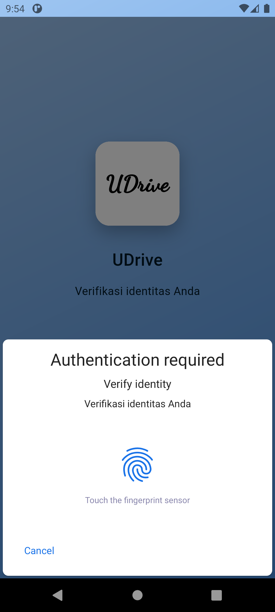
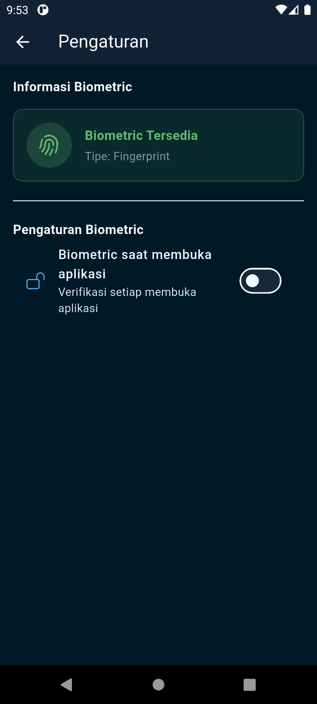

# Driver App (UDrive) - Aplikasi Driver Sederhana

Aplikasi mobile untuk driver untuk mengelola pekerjaan dengan fitur kamera dan GPS.

## 📸 Screenshot Aplikasi

  
  
  
  
  
  
  
  

## 🎯 Fitur Utama & Unduh

- Manajemen pekerjaan dengan status: Tertunda, Berlangsung, Selesai
- Multiple stops per job (Pickup & Dropoff)
- Ambil foto bukti lokasi menggunakan kamera
- Konfirmasi koordinat GPS otomatis
- Biometric menggunakan Fingerprint
- Penyimpanan data lokal dengan SharedPreferences
- UI yang clean dan user-friendly
- State management dengan Riverpod

- Link unduh: https://drive.google.com/file/d/1LKVseYB1OVoqUJQt0AjjAgDUXOZbIefp/view?usp=sharing

## 📱 Cara Menggunakan Aplikasi

### 1. Melihat Daftar Pekerjaan

- Buka aplikasi, akan melihat 3 tab: Tertunda, Berlangsung, dan Selesai
- Tekan pada salah satu pekerjaan untuk melihat detail

### 2. Memulai Pekerjaan

- Pilih pekerjaan pada tab Tertunda
- Tekan tombol "Mulai Pekerjaan"
- Konfirmasi untuk memulai pekerjaan
- Status pekerjaan akan berubah menjadi Berlangsung
- Pekerjaan akan pindah ke tab Berlangsung

### 3. Menyelesaikan Stop

Untuk setiap stop, harus menyelesaikan 2 langkah:

#### Langkah 1: Ambil Foto
- Tekan stop sesuai urutan
- Tekan bagian "Ambil Foto"
- Ambil foto dan pratinjau foto akan muncul
- Pilih "Gunakan Foto" atau "Ambil Ulang"

#### Langkah 2: Konfirmasi GPS
- Tekan bagian "Konfirmasi Koordinat Lokasi"
- GPS akan otomatis mendapatkan koordinat

#### Selesaikan Stop
- Tekan tombol "Selesaikan Stop"
- Stop akan diberi status Selesai

### 4. Menyelesaikan Job

- Setelah semua stop diselesaikan
- Pekerjaan otomatis berubah status menjadi Selesai
- Pekerjaan akan pindah ke tab Selesai

## 📝 Validasi pada Aplikasi

**Job Management**
- Tidak bisa start job ketika ada job lain yang sedang ongoing
- Tidak bisa complete stop jika belum ambil foto dan GPS

**Stop Validation**
- Harus ambil foto
- Harus konfirmasi GPS
- Kedua langkah harus diselesaikan agar bisa tekan "Selesaikan Stop"

**Auto Complete Job**
- Job otomatis complete jika semua stop sudah selesai
